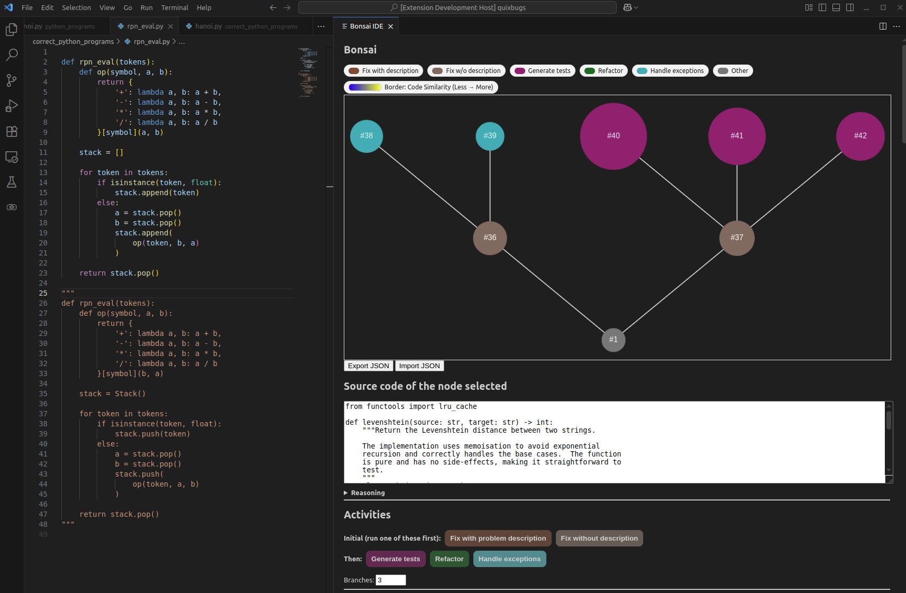

# 🌳 Bonsai Code

**Bonsai** is a visual **bug-fixing & software-engineering environment** inside VS Code.  
Start from the **active file**, then apply activities powered by an **LLM** to generate **multiple options** and explore **alternative branches**:
- **Fix the problem** (mandatory first step, with or without a short description)
- **Generate tests**
- **Refactor**
- **Handle exceptions**

**Fill color = last activity**, **leaf borders = similarity** (blue→red vs. the selected leaf), **right-click → Trim** to prune subtrees, and **Export/Import** sessions as JSON.

 <!-- placeholder -->

---

## Installation

### Option A — Marketplace (when available)
1. VS Code ➜ **Extensions** view  
2. Search **“Bonsai”** ➜ **Install**

### Option B — VSIX file
1. VS Code ➜ **Extensions** (⋯) ➜ **Install from VSIX…**  
2. Select your `bonsai-*.vsix`

### Option C — From source (this repo)
```bash
# In the repo folder
npm install
npm run compile
code .
# Launch dev host
# VS Code: press F5
```

> **API key:** set your LM STUDIO url before launching:
>
> * macOS/Linux: `export BONSAI_LM_URL=your_api_key_here`
> * Windows (PowerShell): `$env:BONSAI_LM_URL="your_api_key_here"`


> **Model:** set your LM STUDIO model before launching:
>
> * macOS/Linux: `export BONSAI_LM_MODEL=gpt-oss-20b`
> * Windows (PowerShell): `$env:BONSAI_LM_MODEL="gpt-oss-20b"`
---

## Quick Use

1. Open a source file ➜ **Ctrl/Cmd+Shift+P → “Start Bonsai”** (the active file becomes the first node).
2. **Always start with *Fix the problem***.
3. When applying an activity, use the **numeric input** to spawn **N branches** (N≥1) with different options.
4. Select a **leaf** to see **similarity borders** on other leaves (cool→warm = less→more similar).
5. Check the **Details** pane (Code, Reasoning, Similarity, Code Metrics).
6. **Right-click → Trim** to prune a node and its children.
7. **Export JSON** to save; **Import JSON** to restore.

 <!-- placeholder -->
 <!-- placeholder -->
 <!-- placeholder -->
 <!-- placeholder -->


---

## Commands

* **Start Bonsai**: Opens Bonsai IDE panel.

---

## Release Notes

### 0.0.4

Get model and LM Studio URL from an input in the Bonsai

### 0.0.3

Save logs when exporting Bonsai.

### 0.0.2

Model selection through environment variable (`export BONSAI_LM_MODEL=gpt-oss-20b`)

### 0.0.1

Initial preview: fix-first workflow, numeric branching, activity colors, similarity borders (leaf), Details pane (code/reasoning/metrics), Trim, Export/Import.

 <!-- placeholder -->

---

## Links

* Quick Start & Tutorial: `TUTORAL.md`
* Repository: [https://gitlab.com/dlumbrer/bonsai-vscode](https://gitlab.com/dlumbrer/bonsai-vscode)

> **Privacy note:** Bonsai can send selected code/prompts to your configured LLM. Don’t include secrets or proprietary data unless permitted.

