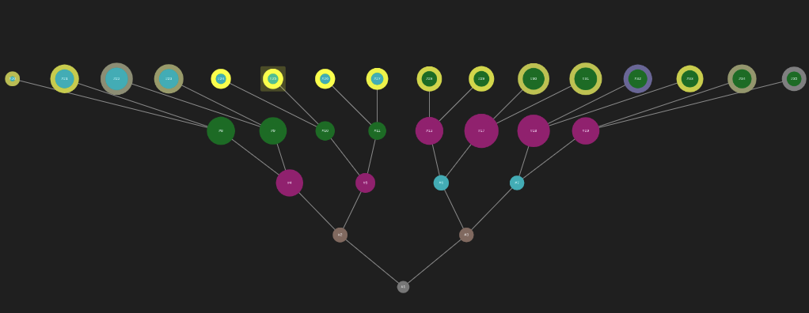
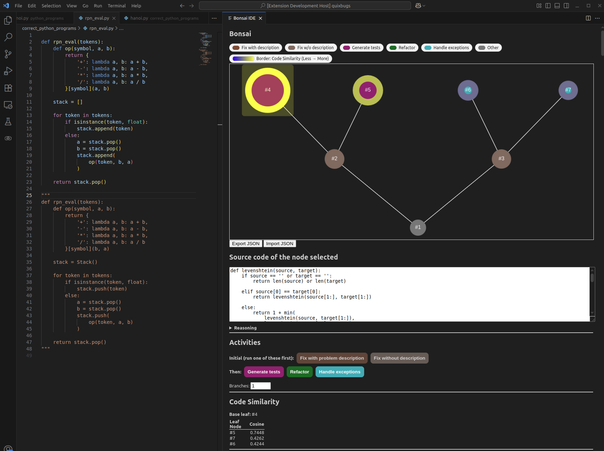
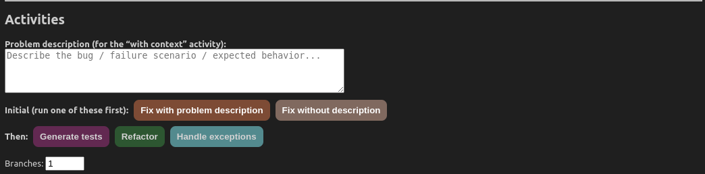
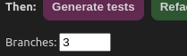
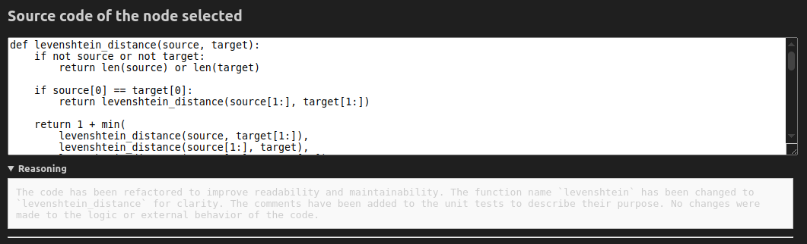

# 🌳 Bonsai Code

**Bonsai** is a visual **bug-fixing & software-engineering environment** that runs as a standalone web server.  
Paste your code, then apply activities powered by an **LLM** to generate **multiple options** and explore **alternative branches**:
- **Fix the problem** (mandatory first step, with or without a short description)
- **Generate tests**
- **Refactor**
- **Handle exceptions**

**Fill color = last activity**, **leaf borders = similarity** (blue→red vs. the selected leaf), **right-click → Trim** to prune subtrees, and **Export/Import** sessions as JSON.

 <!-- placeholder -->

---

## Installation

Run Bonsai as a standalone web server accessible from any browser:

```bash
# In the repo folder
npm install
npm run serve
# Open http://localhost:3000 in your browser
```

The server uses port **3000** by default. To use a different port:

```bash
# Using PORT environment variable
PORT=8080 npm run serve

# Or pass the port as a CLI argument
npm run serve -- 4000
```

---

## Configuration

### LM Studio URL

Set your LM Studio URL before launching:

* macOS/Linux: `export BONSAI_LM_URL=http://localhost:1234/v1`
* Windows (PowerShell): `$env:BONSAI_LM_URL="http://localhost:1234/v1"`

### Model

Set your LM Studio model before launching:

* macOS/Linux: `export BONSAI_LM_MODEL=qwen/qwen2.5-coder-3b-instruct`
* Windows (PowerShell): `$env:BONSAI_LM_MODEL="qwen/qwen2.5-coder-3b-instruct"`

Both values can also be configured interactively in the Bonsai UI.

---

## Quick Use

1. Open **http://localhost:3000** in your browser after starting the server.
2. Paste your code in the text area — this becomes the first node.
3. **Always start with *Fix the problem***.
4. When applying an activity, use the **numeric input** to spawn **N branches** (N≥1) with different options.
5. Select a **leaf** to see **similarity borders** on other leaves (cool→warm = less→more similar).
6. Check the **Details** pane (Code, Reasoning, Similarity, Code Metrics).
7. **Right-click → Trim** to prune a node and its children.
8. **Export JSON** to save; **Import JSON** to restore.

 <!-- placeholder -->
 <!-- placeholder -->
 <!-- placeholder -->
 <!-- placeholder -->

---

## API Endpoints

The server exposes the following HTTP endpoints:

| Endpoint | Method | Description |
|----------|--------|-------------|
| `/` | GET | Serves the main web UI |
| `/events` | GET | Server-Sent Events stream for real-time updates |
| `/message` | POST | Send commands from browser to server |
| `/export` | GET | Download current session as JSON |
| `/import` | POST | Upload a previously-exported JSON session |

---

## Links

* Quick Start & Tutorial: `TUTORIAL.md`
* Repository: [https://gitlab.com/dlumbrer/bonsai-vscode](https://gitlab.com/dlumbrer/bonsai-vscode)

> **Privacy note:** Bonsai sends code/prompts to your configured LLM. Don't include secrets or proprietary data unless permitted.
