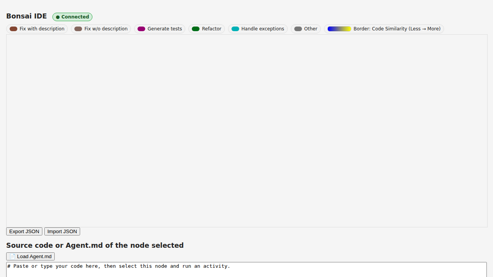
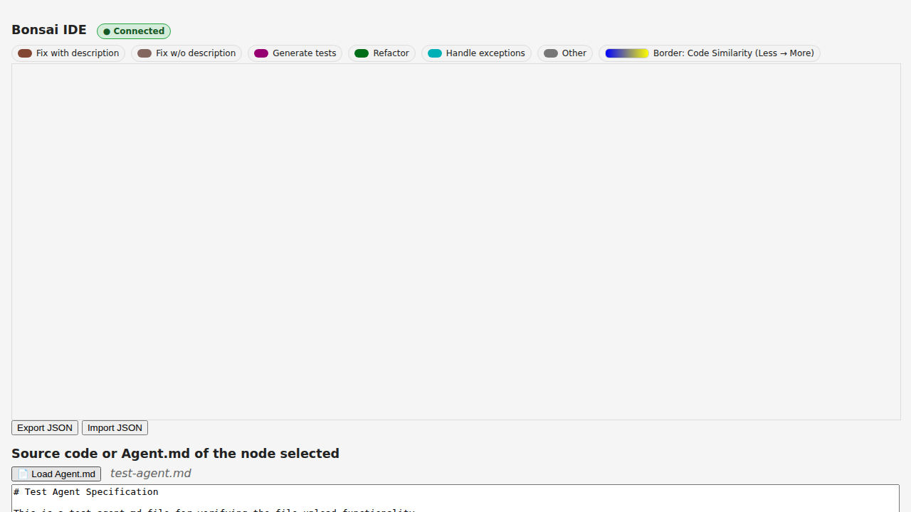

# 🌳 Bonsai Code

**Bonsai** is a visual **bug-fixing & software-engineering environment** that runs as a standalone web server.  
Paste your code, then apply activities powered by an **LLM** to generate **multiple options** and explore **alternative branches**:
- **Fix the problem** (mandatory first step, with or without a short description)
- **Generate tests**
- **Refactor**
- **Handle exceptions**

**Fill color = last activity**, **leaf borders = similarity** (blue→red vs. the selected leaf), **right-click → Trim** to prune subtrees, and **Export/Import** sessions as JSON.



> Note: The legacy VS Code extension has been removed. Bonsai now runs purely as a standalone web app served from this repository.

---

## Installation

Run Bonsai as a standalone web server accessible from any browser:

```bash
# In the repo folder
npm install
npm run serve
# Open http://localhost:3000 in your browser
```

The server uses port **3000** by default. To use a different port:

```bash
# Using PORT environment variable
PORT=8080 npm run serve

# Or pass the port as a CLI argument
npm run serve -- 4000
```

---

## Configuration

### Pi-only model routing

BonsAIDE routes **all LLM work through [Pi](https://www.npmjs.com/package/@earendil-works/pi-coding-agent)**. The standalone server no longer calls LM Studio, Ollama, vLLM, or any other local OpenAI-compatible endpoint directly.

Pi resolves provider credentials from `~/.pi/agent/auth.json`; BonsAIDE never receives, stores, or logs API keys or provider headers.

To use models:

1. Open Pi and run `/login <provider>` for the providers you want to use, for example `pi /login openai` or `pi /login github-copilot`.
2. Start BonsAIDE with `npm run serve`.
3. Click **Load Pi Models** in the Bonsai UI.
4. Select a configured Pi model from the dropdown.
5. Click **Test Pi Model** to verify the selected model is available.
6. Generate code or run repository analysis as usual.

Optional default model:

```bash
export BONSAI_PI_MODEL="pi:openai-codex:gpt-5.5"
```

The selected value must use Pi's `pi:<provider>:<model-id>` format.

---

## Quick Use

1. Open **http://localhost:3000** in your browser after starting the server.
2. Paste your code in the text area — this becomes the first node.
3. **Always start with *Fix the problem***.
4. When applying an activity, use the **numeric input** to spawn **N branches** (N≥1) with different options.
5. Select a **leaf** to see **similarity borders** on other leaves (cool→warm = less→more similar).
6. Check the **Details** pane (Code, Reasoning, Similarity, Code Metrics).
7. **Right-click → Trim** to prune a node and its children.
8. **Export JSON** to save; **Import JSON** to restore.



## Four-clone repository fixing

The **Analyze Repo for Fix** workflow can implement one selected GitHub issue four different ways:

1. Enter a GitHub repository URL, collect issues, and select one issue.
2. Optionally enter shared **Code generation instructions** (allowed files/APIs, style, compatibility, dependencies to avoid, and required tests).
3. Select a Pi model and click **Analyze Repo for Fix**.
4. BonsAIDE statically locates likely impacted files and drafts exactly four distinct plans.
5. It creates four isolated clones under `artifacts/repo-fix-workspaces/<owner>__<repo>/issue-<n>/clone-1..4/`.
6. The selected model generates and applies one plan in each clone. The source cache is never modified.
7. BonsAIDE detects and runs dependency setup, build, and test commands separately in each clone. Build and tests are both attempted and logged.
8. The UI reports `PASS`, `PARTIAL`, or `FAIL`, changed files, clone path, diff, and report path for each candidate.

Reports and logs are stored in each clone's `.bonsai-reports/` folder. Nothing is pushed, merged, or committed automatically. Build and test scripts execute repository code, so analyze only repositories you trust.

## Error reproduction workflow

The **Attempt Error Reproduction** workflow tries to create evidence for a selected issue before proposing a fix:

1. Select a collected GitHub issue and click **Attempt Error Reproduction**.
2. Confirm the safety warning; this workflow executes detected repository commands.
3. BonsAIDE creates one isolated clone under `artifacts/repo-reproduction-workspaces/<owner>__<repo>/issue-<n>/reproduction/`.
4. It runs the detected setup, build, and test commands to establish a clean baseline. For Python repositories, BonsAIDE creates `.bonsai-venv` inside the clone, installs `pytest` there, detects conventional test directories and root-level `test_*.py`/`*_test.py` modules, and uses the virtualenv interpreter without changing global Python packages.
5. The selected Pi model generates test files only; production files, manifests, lockfiles, and configuration are rejected.
6. BonsAIDE applies the generated regression test and reruns the detected build and tests.
7. The result is classified as **REPRODUCED** only when the baseline tests pass, the post-test run fails, and its output identifies a generated regression-test file. Passing generated tests are **NOT_REPRODUCED**; baseline failures, build failures, unavailable test commands, or unrelated failures are **INCONCLUSIVE**.

The UI displays the generated test, captured failure output, commands, workspace, diff, and report path. Reports are stored under the clone's `.bonsai-reports/reproduction/` directory. Nothing is committed or pushed automatically.

---

## UI Rearrangement & Interactivity Ideas

- Keep the code input, tree canvas, and details panel resizable with quick toggle buttons to focus on one region at a time.
- Add keyboard shortcuts and a tiny command palette for spawn/trim/select-parent plus a repeat-last-action hotkey.
- Surface connection + Agent.md load state inline in the header with a one-click reconnect or reload control.
- Collapse logs/metrics/diff panes into tabs next to Details and pair them with a small mini-map for quick jumps.
- Let users pin favorite activities and branch counts into a compact action bar near the header.

---

## API Endpoints

The server exposes the following HTTP endpoints:

| Endpoint | Method | Description |
|----------|--------|-------------|
| `/` | GET | Serves the main web UI |
| `/events` | GET | Server-Sent Events stream for real-time updates |
| `/message` | POST | Send commands from browser to server |
| `/export` | GET | Download current session as JSON |
| `/import` | POST | Upload a previously-exported JSON session |

---

## Agent & Contributor Documentation

BonsAIDE includes repository-specific documentation to help human contributors and coding agents, especially local models, understand and maintain the project safely.

Start here:

* Contributor and agent rules: `AGENTS.md`
* Architecture and maintenance overview: `REPOSITORY_ANALYSIS.md`
* Agent skills proposal summary: `SKILLS_PROPOSAL_SUMMARY.md`
* Skills library entry point: `.pi/agent/skills/README.md`
* Task-to-skill router: `.pi/agent/skills/INDEX.md`

Specialized maintenance skills:

* `.pi/agent/skills/llm-integration-specialist/SKILL.md` — Pi model registry, model delegation, prompt parsing, and token handling
* `.pi/agent/skills/state-and-protocol-guide/SKILL.md` — Bonsai state, branches/nodes, import/export schema, graph rendering, and browser/server protocol
* `.pi/agent/skills/similarity-and-analysis-crew/SKILL.md` — TF-IDF similarity, Lizard metrics, GitHub issue/repository analysis, and analysis tests

Recommended agent flow: read `AGENTS.md`, skim `REPOSITORY_ANALYSIS.md`, choose a task-specific skill through `.pi/agent/skills/INDEX.md`, then run `npm run lint && npm run compile && npm run test` before committing code changes.

---

## Links

* Quick Start & Tutorial: `TUTORIAL.md`
* Repository: [https://github.com/raux/BonsAIDE](https://github.com/raux/BonsAIDE)

> **Privacy note:** Bonsai sends code/prompts to your configured LLM. Don't include secrets or proprietary data unless permitted.
