# Bonsai — Quick Start & Tutorial

> When you launch **Start Bonsai**, the canvas appears with a **first node** that corresponds to the **code file currently open** in your editor.  
> **Mandatory rule (always): your very first action must be _Fix the problem_.**

---

## Table of Contents
- [0) Prerequisites](#0-prerequisites)
- [1) Open a file & Start Bonsai](#1-open-a-file--start-bonsai)
- [2) UI at a glance](#2-ui-at-a-glance)
- [3) Activities (with numeric branching)](#3-activities-with-numeric-branching)
- [4) Branch management](#4-branch-management)
- [5) Interaction (selection, borders, reasoning, code & metrics)](#5-interaction-selection-borders-reasoning-code--metrics)
- [6) Trim](#6-trim)
- [7) Export (save your session)](#7-export-save-your-session)
- [8) Troubleshooting](#8-troubleshooting)
- [9) Short practice](#9-short-practice)
- [10) Keyboard tips](#10-keyboard-tips)

---

## 0) Prerequisites

- **VS Code** (latest stable)
- **Bonsai** extension installed
  <!-- TODO: insert screenshot: VS Code Extensions view showing Bonsai -->

---

## 1) Open a file & Start Bonsai

1. Open any source file (e.g., `.py`, `.js`, `.ts`, `.java`) and keep it **active** in the editor tab.  
   

2. Press **Ctrl + Shift + P** (Windows/Linux) or **Cmd + Shift + P** (macOS) and run **“Start Bonsai”**.  
   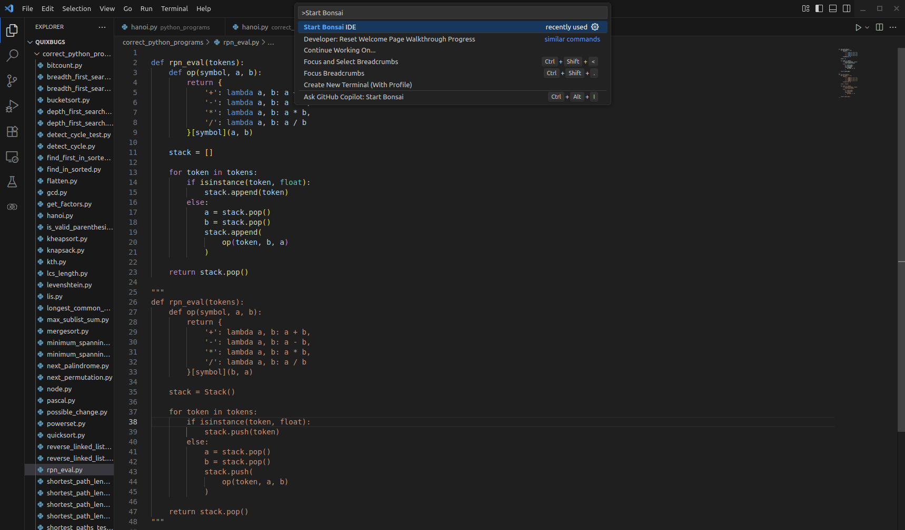

> You should see the **graph** with a **first node** representing the **currently open file**.  

---

## 2) Bonsai at a glance

- **Bonsai / Node map**  
  - Click a node to select it (highlight).  
  - **Node fill color = last activity applied on that node** (see legend below).
  - **Node border colors = similarity (if the node is a leaf)** (see Interaction section).  
  - **Node size = Number of tokens required to get the response of the LLM**
  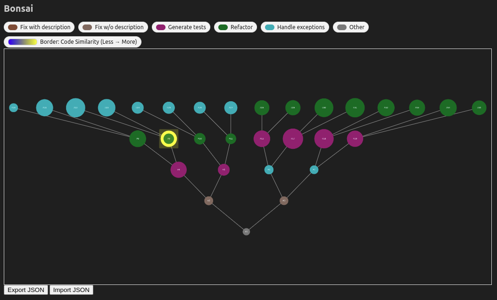

- **Activity legend (colors)** — each color denotes the **activity applied**:
  - **Fix the problem (with or w/o description)** — Warm brown w/o description or Dark brown with description.  
  - **Generate tests** — Magenta.  
  - **Refactor** — Green. 
  - **Handle exceptions** — Turqoise.
  - **Initial node (or other)** —  Gray.
  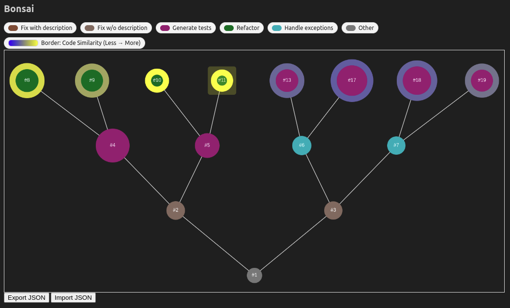

- **Details pane (bottom or side)**  
  Shows **Code**, **Reasoning**, **Similarity**, and **Code Metrics** for the selected node/action.  
  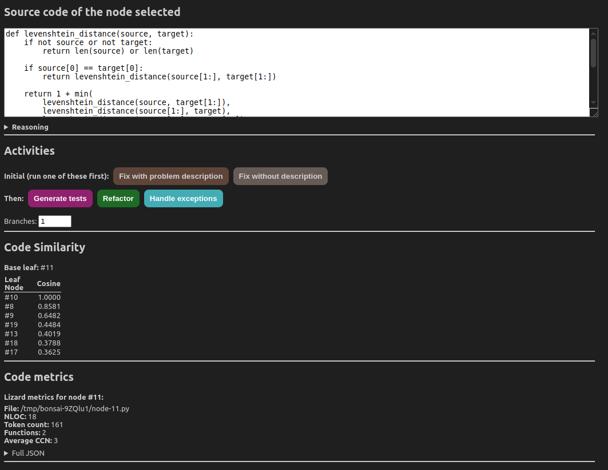

---

## 3) Activities (with numeric branching)

**Click on a node first to select it, you will see a yellow border applied to it**

> **Always start with _Fix the problem_.** After that, you can apply any activity in any order and as many times as you wish.

**Common flow to apply an activity:**
1. **Select** a node (usually a leaf or a function you want to act on).  
2. Click an **Activity**:
   - **Fix the problem** (mandatory first step; optional short description)
   - **Generate tests**
   - **Refactor**
   - **Handle exceptions**
   

3. **Numeric input for branching** appears (e.g., “Number of variants/branches to create”):
   - Enter **1** to apply the activity **in the current branch**.
   - Enter **N > 1** to **spawn N sibling branches**, each holding a separate outcome of the activity (e.g., multiple fix alternatives).
   

4. Generate → Bonsai applies the activity, **colors** the affected node(s) according to the activity, and records outputs in the **Details pane**.

> **Tip:** Use multiple variants when you want to explore alternative fixes/test suites/refactors in parallel.

---

## 4) Branch management

- **Create branches automatically** via the **numeric input** when applying an activity (N > 1).

- **Select a node** of different branches to compare outcomes.  
  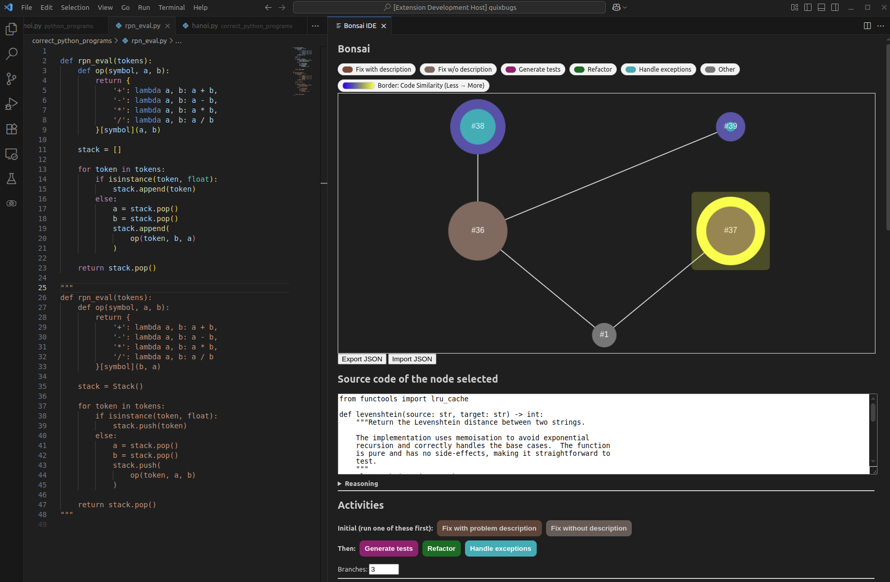
  
  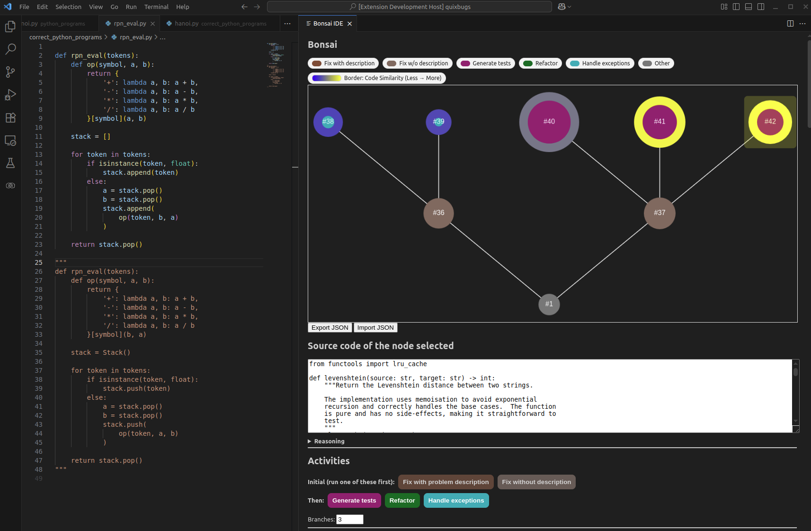

> You can **re-apply the same activity** multiple times across different branches (e.g., two distinct “Handle exceptions” strategies).

---

## 5) Interaction (selection, borders, reasoning, code & metrics)

### 5.1 Selection & borders (leaf vs. non-leaf)

- **Click a node to select it** (yellow border = selection).
- **If the selected node is a _leaf_**:
  - The **other leaf nodes** display **border colors** (e.g., **blue → red**) encoding their **similarity to the selected leaf**:
    - **Cooler border** = **less similar**
    - **Warmer border** = **more similar**
  
  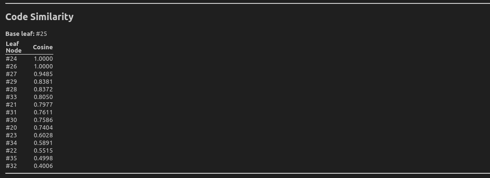

- **If the selected node is _not_ a leaf (container/parent)**:
  - You will see **only the yellow selection** (no similarity broadcast).
  - The **next activity** you run will **apply to this node’s code**; if you set the **numeric input** to `N>1`, it will **spawn N branches** from **this** node.
  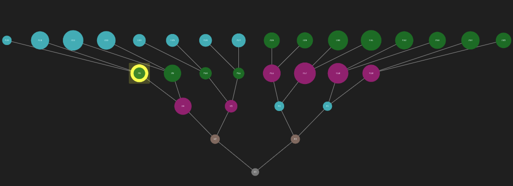

> **Legend reminder:** **Border** = similarity (only when a **leaf** is selected as anchor).  
> **Fill color** = **last activity applied on that node** (Fix / Generate tests / Refactor / Handle exceptions).

### 5.2 Details (bottom): Code, Reasoning, Similarity Code, and Code Metrics

When you select a node (or after an activity runs), the **Details** pane shows:

- **Code**: the proposed **patch**, **generated tests**, **refactor**, or **exception handling**.  
  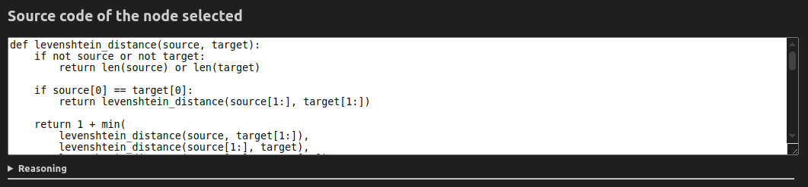
- **Reasoning** (when available): brief explanation of _why_ the suggestion/patch/tests were produced.  
  
- **Metrics**:
  - **Similarity code** (shown when the **anchor is a leaf**)
  
  - **Code metrics** such as LOC, Token count, CCN.
  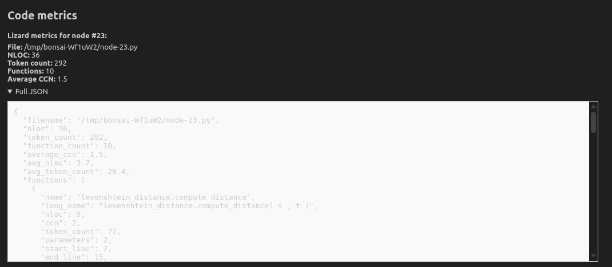

Use them together:
- **Borders** → where to look (similar candidates)  
- **Reasoning** → why this change might help  
- **Code & Metrics** → what changed and how big/similar it is

---

## 6) Trim

- **Right-click a node → Trim** to **prune** that node **and all its children** from the **current canvas/branch** (like pruning a bonsai).  
  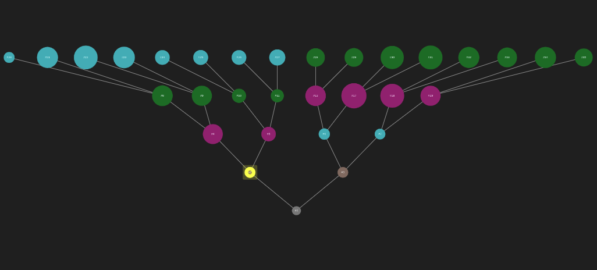
  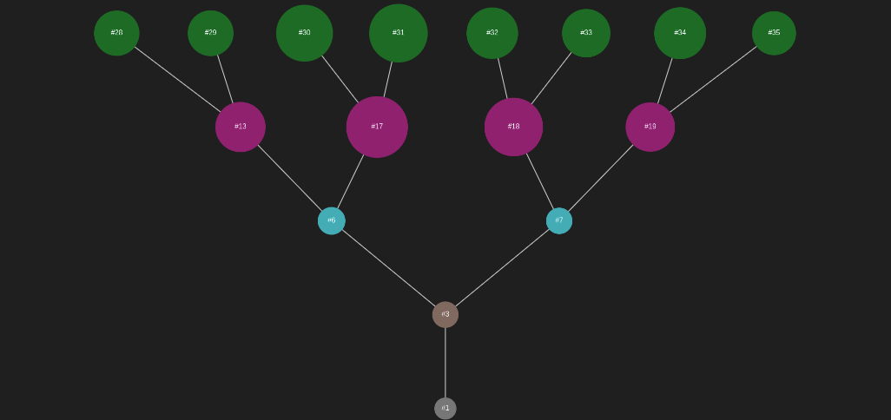

> This **does not delete files**; it simply **removes the selected sub-tree from the bonsai** so you can reduce clutter and focus on what matters now.
---

## 7) Export (save your session)

1. Click **Export JSON** in the Bonsai view.
2. Save the export file or copy the **export ID**.  
3. You can import it in the future by clicking on **Import JSON**
   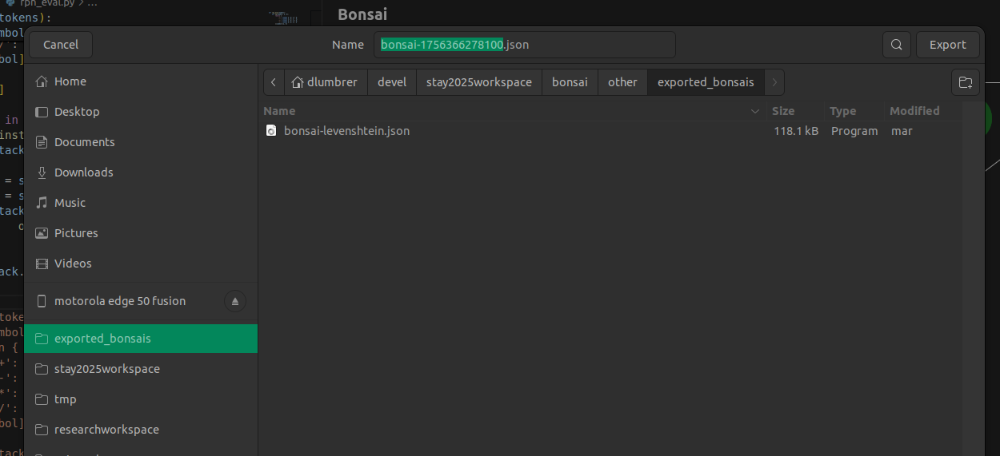

> **Always export before closing VS Code.** If you’re in a study, export is required.

---

## 8) Troubleshooting

- **Bonsai shows no initial node** → Ensure a **file is open and active** before running *Start Bonsai*.  
- **Selection highlight or borders not visible** → Re-select the node.
- **Activities disabled** → Select a node in the Bonsai canvas first.  
- **No numeric input when applying activities** → Update the extension; verify the activity dialog hasn’t been dismissed.  
- **Export option missing** → Start or resume a **Bonsai session** first.  

---

## 9) Short practice (3–5 min)

1. Open a file, **Start Bonsai**, and **select** a leaf node.  
2. **Fix the problem** (mandatory first action) with a **description** like “try off-by-one fix”. Set the **numeric input** to **2** to create two branches.  
3. In one branch, run **Generate tests**; in the other, try **Refactor**.  
4. Inspect **borders** (similarity), read **reasoning**, check **metrics**.  
5. Toggle **Trim**, then **Export**.

[Video Example](https://youtu.be/TlmZBSgy1wA)